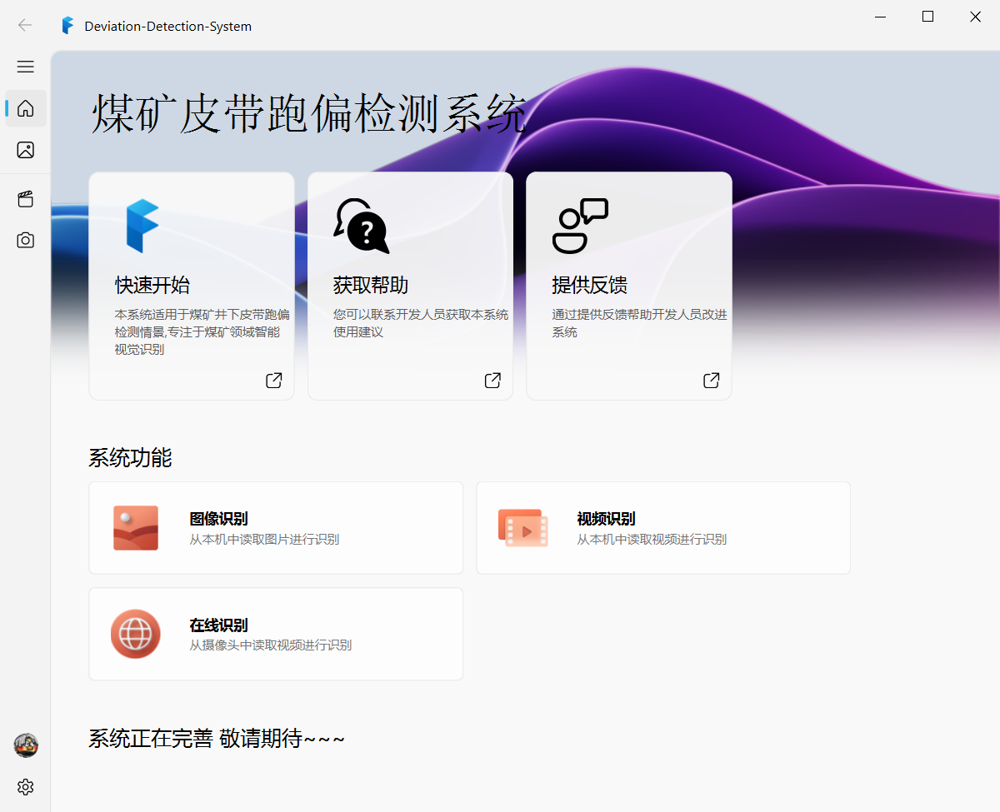
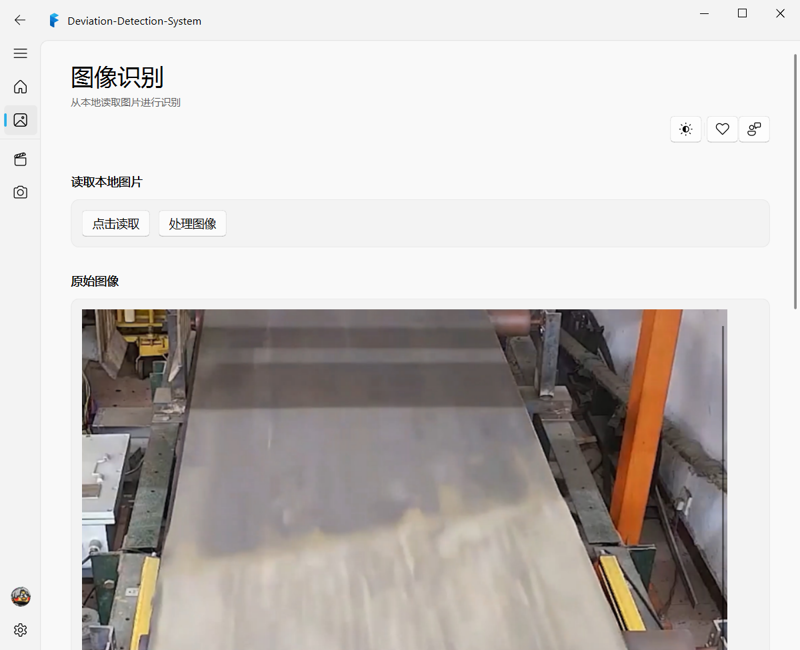
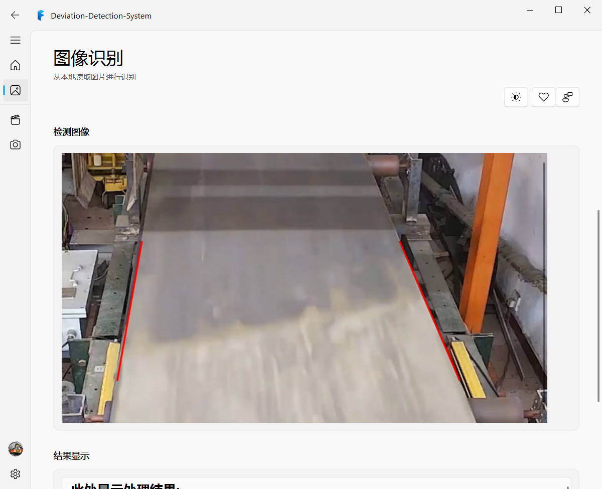

<h1 align="center">
皮带跑偏识别系统
 </h1>

## 说明:

本项目为本科毕设期间设计的简易煤矿皮带跑偏识别系统，采用传统计算机视觉知识，主要使用OpenCV提供API，通过在实验室测试跑偏系统检测结果，取得较好数据，后通过结合PyQt5将跑偏系统进行封装并设计可视化界面，最后结合[PyQt-Fluent-Widgets](https://github.com/zhiyiYo/PyQt-Fluent-Widgets)对整体界面进行美化。

## 已实现功能：

- [x] 图像识别
- [x] 视频识别
- [x] 可视化设计
- [x] 整体界面美化

## 后期设计方向：

- [ ] 摄像头识别
- [ ] 可视化界面封装视频识别功能
- [ ] 可视化界面封装摄像头识别功能
- [ ] 考虑采用机器学习方法改进系统识别成功率

##  系统原理：

- 采用传统视觉方法检测皮带是否跑偏，皮带边缘检测部分主要借鉴于车道线检测。
- 判定是否跑偏采用检测出皮带托辊角点位置坐标，结合相关跑偏判定基准进行跑偏判定。

## 系统缺点：
由于实验室皮带环境中存在诸多无关区域，在摄像头采集视频后需对图像进行进一步处理。

- 系统图像增强部分花费较多时间，在实际应用过程中需进一步结合环境优化增强算法；
- 系统在皮带边缘检测中设置多处*ROI*区域对噪声部分进行过滤，此方法需要根据实际应用环境修改底层代码，不够智能。
- 后续系统仍需诸多完善。

## 使用方法：

1. 直接运行目录下belt.py文件，此文件为未进行QT封装源文件；
2. 运行main.py文件，此文件已封装识别算法，显示可视化主界面；
3. 运行login.py文件，此文件添加登录界面，默认账户密码为**<u>admin</u>**  ,  **<u>123456</u>**。其余操作登录成功后于主界面进行操作。

> 注：系统用户账户密码并未设置数据库，数据仅存放于内存中，后期可根据需求添加。

---

## 结果展示：

---

**后续丰富其余功能~~~**
